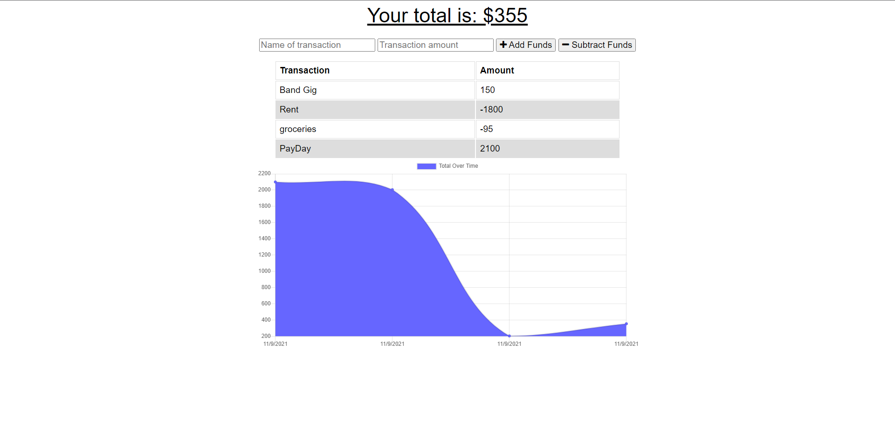

# PWA-Budget-Tracker

A budget tracking application with offline functionality

## Description

## Table of Contents

- [Installation](#installation)

- [Technologies](#technologies)

- [Usage](#usage)

- [License](#license)

- [Contributing](#contributing)

- [Tests](#tests)

- [Deployed Link](#deployed)

- [Questions](#questions)

## Technologies

    - HTML
    - CSS
    - JavaScript
    - Node.js
    - MongoDB
    - Mongoose
    - Express.js

## Installation

To install necessary dependencies, run the following command:

---

    npm i

---

## Usage

Run `npm start` command in the main directory to start the server after installing dependencies. Open a browser and go to localhost:3000

You should see this homepage if navigated correctly:

You can alter the graph by withdrawing or depositing money within the input text fields. Either transactions will be saved to the database.

## License

This project is licensed under the MIT license

## Contributing

    1. Clone the main branch into your local drive
    2. Create a branch with a proper name
    3. Create a pull request
    4. Contact me via email with a summary of the contribution

## Tests

Run the following command to run tests:

---

    n/a

---

## Deployed

Live URL: https://thawing-river-72353.herokuapp.com/

## Questions

If you have any questions about the repo, open an issue or contact me directly at oscar.a.vizcaino@icloud.com. You can find more of my work at
[oscarV42](https://github.com/oscarV42/).
